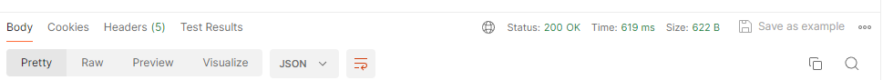
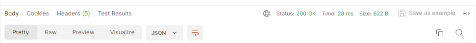
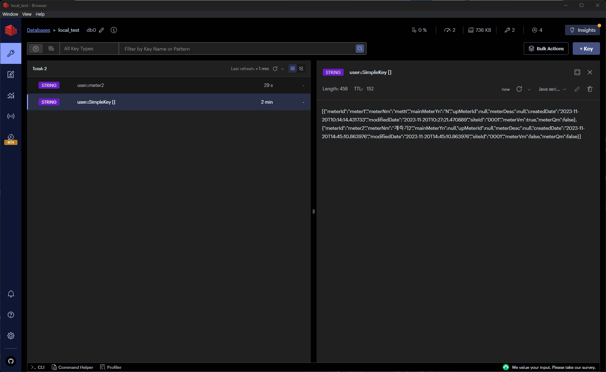

## Redis
### ✨ Redis란?
#### 🎁 기본 정보
- [공식문서](https://docs.spring.io/spring-data/redis/reference/redis.html)
- [설치하기](https://github.com/microsoftarchive/redis/releases)
- [GUI 사용하기](https://redis.com/redis-enterprise/redis-insight/)

#### 🎁 Redis란?
- key, value 구조의 비정형 데이터를 저장하고 관리하기 위한 비관계형 데이터베이스 관리 시스템
- 인메모리 데이터 구조 => 처리속도가 빠름
- String, Lists, Sets, Sorted Sets, Hashes 자료구조 지원
- 데이터베이스, 캐시, 메시지 브로커 등으로 사용 됨

#### 🎁 Cache Server
- DB에 매번 접근 할 경우, 사용자/요청이 많아질수록 DB에 과부하 걸릴 수 있고, 속도가 느려짐
- 한번 읽어 온 데이터를 임의의 메모리 공간에 저장하여 다음에 읽을 때는 빠르게 결과값 가져올 수 있음
- 참고자료 : [[REDIS] 📚 캐시(Cache) 설계 전략 지침 💯 총정리](https://inpa.tistory.com/entry/REDIS-📚-캐시Cache-설계-전략-지침-총정리)

#### 🎁 주의점
- Single Tread이므로 시간 복잡도 고려할 것 => O(N) 명령 주의하기!!
    - keys => `scan` 으로 대체 가능
    - flushall, flushdb
    - delete collections
    - get all collections
- 데이터 할당, 해제 과정에서 메모리 파편화가 발생하여 응답 속도 느려 질 수 있음
    - 비슷한 크기의 데이터로 사용하는게 유리

#### 🎁 참고 : connection factory 종류
- Lettuse
    - connection instance를 여러 쓰레드에서 공유 할 수 있음. 
    - 기본 configuration 제공
- Jedis 
    - jedis-pool을 사용하여 connection instance를 미리 만들어 놓고 대기 (비용발생)
    - configuration 설정 필요 (`JedisPoolConfig`, `JedisConnectionFactory`)
- 참고자료 : [Jedis 보다 Lettuce 를 쓰자](https://jojoldu.tistory.com/418)

### ✨ Springboot 사용하기 (기본)
1. dependency 추가
```xml
<dependency>
    <groupId>org.springframework.boot</groupId>
    <artifactId>spring-boot-starter-data-redis</artifactId>
</dependency>
```

2. application.yml 파일에 redis 설정 추가
```yaml
spring:
  data:
    redis:
      host: 127.0.0.1
      port: 6379
```

3. configuration 작성 (option)
- 기본적으로는 springboot auto configuration 제공하므로
- 필요 시 작성
```java
@Configuration
public class RedisConfig {

    @Value("${spring.data.redis.host}")
    private String host;

    @Value("${spring.data.redis.port}")
    private int port;

   @Bean
    public RedisConnectionFactory redisConnectionFactory() {
        //>> Jedis
//        return new JedisConnectionFactory(new RedisStandaloneConfiguration(host, port));
        //>> Lettuse
        return new LettuceConnectionFactory(host, port);
    }

   @Bean
    public RedisTemplate<String, Object> redisTemplate() {

        RedisTemplate<String, Object> template = new RedisTemplate<>();
        template.setConnectionFactory(redisConnectionFactory()); //연결 설정

        //데이터는 key: json value로 들어옴
        //redis template 설정
        //일반적인 key:value 의 경우 serializer
        template.setKeySerializer(new StringRedisSerializer());
        template.setValueSerializer(new Jackson2JsonRedisSerializer<>(Object.class));

        //hash 사용 할 경우 serializer
        template.setHashKeySerializer(new StringRedisSerializer());
        template.setHashValueSerializer(new Jackson2JsonRedisSerializer<>(Object.class));

        //기본 serializer는 일단 string type으로 설정해보자!
        template.setEnableDefaultSerializer(true);
        template.setDefaultSerializer(new StringRedisSerializer());

        return template;
    }

}
```

4. RedisOperations 인터페이스를 이용하여 redis에 CRUD
```java
private final RedisOperations<String, String> redisOperations;

//1. 전체 키 가져오기
Set<String> keys = redisOperations.keys("*"); //패턴을 넣어주면 패턴에 따른 키 가져올 수 있음

//2. 데이터 가져오기
String data = redisOperations.opsForValue().get(key);
List<Object> values = redisOperations.opsForHash().values(key);

//3. 데이터 추가하기
//key-value 형태이므로 key가 중복 될 경우 key의 값을 덮어씀
redisOperations.opsForValue().set(key, jsonStr);
redisOperations.opsForHash().put(key, "hashKey", jsonStr);

//4. 데이터 삭제하기
redisOperations.delete(key);
```

### ✨ Springboot - Redis Cache 사용하기
1. config 작성
```java
@Configuration
@EnableCaching
@RequiredArgsConstructor
public class RedisCacheConfig {

    private final ObjectMapper objectMapper;

    @Bean
    public CacheManager cacheManager(RedisConnectionFactory redisConnectionFactory) {
        RedisCacheConfiguration redisCacheConfiguration = RedisCacheConfiguration
                .defaultCacheConfig()
                .serializeKeysWith(RedisSerializationContext.SerializationPair.fromSerializer(new StringRedisSerializer()))
                .serializeValuesWith(RedisSerializationContext.SerializationPair.fromSerializer(new GenericJackson2JsonRedisSerializer(objectMapper)))
                .entryTtl(Duration.ofMinutes(3L));

        return RedisCacheManager.RedisCacheManagerBuilder
                .fromConnectionFactory(redisConnectionFactory)
                .cacheDefaults(redisCacheConfiguration)
                .build();

    }
}
```

2. 사용하고자 하는 곳에 @Cacheable 붙여주기
```java
@Cacheable(value = "user", cacheManager = "cacheManager")
public List<Meter> getAllMeters() {
    log.info("여기>>>getAllMeters()");
    return meterRepository.findAll();
}
```

3. 확인
- 첫번째 요청 시 619ms

- 두번째 요청 시 28ms

- redis gui 확인

